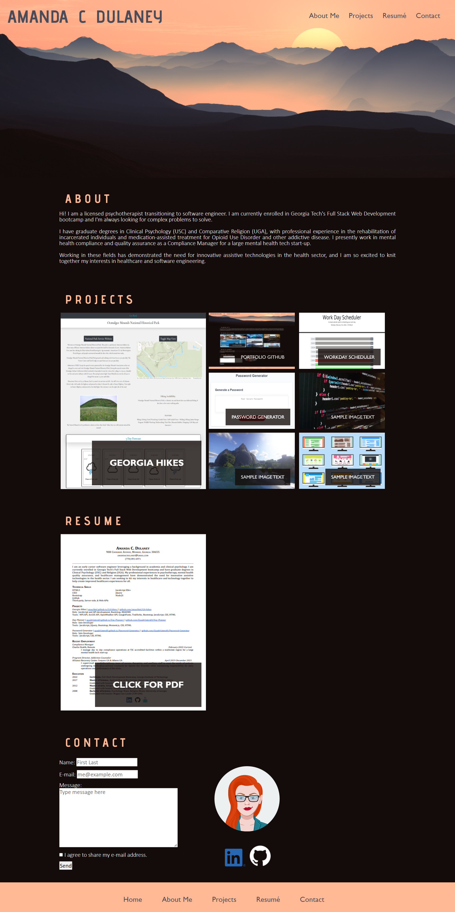

# ACD Portfolio
## Description
For this project, I created a portfolio page to share my deployed applications and function as a digital resume. This project is a work-in-progress and will be updated as my skills grow. This application demonstrates my skills with semantic html, flexbox, media queries, CSS variables, and responsive web design. 

## Table of Contents
- [Usage](#usage)
- [Credits](#credits)
- [License](#license)
- [Badges](#badges)

## Usage
Visit my [portfolio website here](https://quadrilateral0.github.io/ACD-Portfolio/) and see below for a current screenshot.

## Credits
A thanks to my resources:
- [EmailJS](https://www.emailjs.com/)
- [Functional Accessibility Evaluator 2.2](https://fae.disability.illinois.edu/anonymous/?Anonymous%20Report=/)
- [Font Squirrel Webfont Generator](https://www.fontsquirrel.com/tools/webfont-generator)
- [Pixabay](https://pixabay.com/)
- [Google Fonts - Advent Pro](https://fonts.google.com/specimen/Advent+Pro)
- [Bacon Ipsum - A Meatier Lorum Ipsum Generator](https://baconipsum.com/)
- [GoFullPage - Full Page Screen Capture Chrome Extension](https://chrome.google.com/webstore/detail/gofullpage-full-page-scre/fdpohaocaechififmbbbbbknoalclacl/related)
- [Free Avatar Maker](https://avatarmaker.com/)
- [Visual Studio Code](https://code.visualstudio.com/download)

And thanks to these tutorials:
- [Pagecloud - How to add custom fonts](https://www.pagecloud.com/blog/how-to-add-custom-fonts-to-any-website)
- [CSS Positioning and Flexbox Explained](https://www.freecodecamp.org/news/css-positioning-and-flexbox-explained/)
- [MDN Web Docs](https://developer.mozilla.org/)
- [W3 Schools](https://www.w3schools.com/)

## License

## Badges
